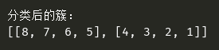

## AGNES
 
代码查看：[AGNES.py](AGNES.py)  
  
源数据：[data.xlsx](data.xlsx)  
 
算法描述：  
输入：包含N个对象的数据库，终止条件簇的数目k  
输出：k个簇，达到终止条件规定的簇数目  
  

将每个对象当成一个初始簇  
Repeat:  
&emsp;&emsp;根据两个簇中最近的数据点找到最近的簇； 
&emsp;&emsp;合并两个簇，生成新的簇的集合； 
Until 达到定义的簇的数目  
 
  

结果：  
