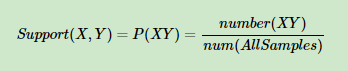
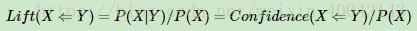
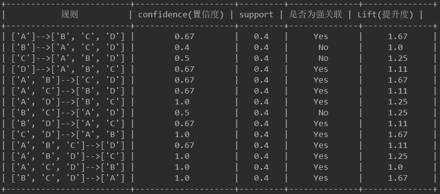

## 强关联规则

代码查看：[Apriori.py](Apriori.py)   
 
源数据： [data.xlsx](data.xlsx)  
 

第一步，递归算出频繁项目集以及最大频繁项目集： 
> 频繁项目集：[['A'], ['B'], ['C'], ['D'], ['E'], ['A', 'B'], ['A', 'C'], ['A', 'D'], ['B', 'C'], ['B', 'D'], ['B', 'E'], ['C', 'D'], ['C', 'E'], ['A', 'B', 'C'], ['A', 'B', 'D'], ['A', 'C', 'D'], ['B', 'C', 'D'], ['B', 'C', 'E'], ['A', 'B', 'C', 'D']]
> 最大频繁项目集： ['A', 'B', 'C', 'D'] 

原理：   
 
支持度的计算：  
 
 
置信度的计算： 
 
 
提升度的计算： 
 
 
运行结果： 
 
