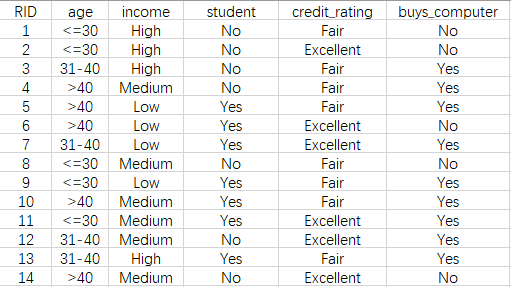
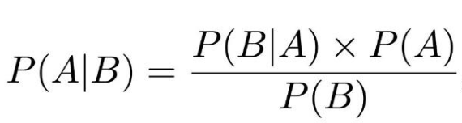
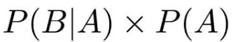

## Bayes 分类

代码查看：[Bayes.py](Bayes.py)   
 
源数据： [data.xlsx](data.xlsx)  
 

需要预测的数据：  
> {'age': '<=30', 'income': 'Medium', 'student': 'Yes', 'credit_rating': 'Fair'} 
 
 
计算公式：  
 
 
在此问题中只需计算分子的概率的最大值，即可预测结果：
 
 

运行结果： 
 

