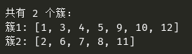

## DBSCAN 

代码查看：[dbscan.py](dbscan.py)  
  
源数据：[data.xlsx](data.xlsx)  
 
算法描述：  
输入：包含N个对象的数据库，半径R，最少数目MinPts  
输出：所有生成的簇，达到密度要求  
  

Repeat:
	从数据库中抽取一个未处理过的对象；
	If 抽出的对象是核心点
		找出所有从该点密度可达的对象，形成一个簇
	Else 抽出的点是边缘点（非核心对象）
		跳出循环，寻找下一点
Until 所有点都被访问过
 
  

结果：  
