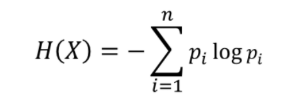
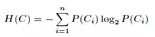
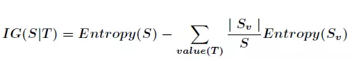
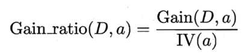
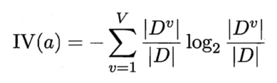
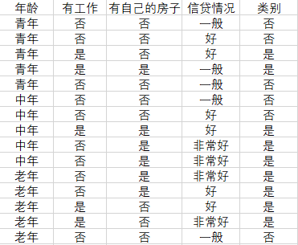

## 决策树
*** 
### ID3算法
代码查看：[ID3](ID3.py)  
示例：  
根据一个人的外貌特征判断性别，特征属性有头发长短、体重、身材  
[数据集](gua.xlsx)：   
   

信息熵计算：   
 

条件熵计算： 
  
 
信息增益计算：  
 
 
代码运行结果：  

 
决策树绘制代码为：[plotTree.py](plotTree.py) 

***

### C4.5算法
代码查看：[C4.5](C45.py)   
信息增益率计算：  
 

其中IV(a)的计算方式：  
 

代码运行结果：  

***

### CART
代码查看：[CART.py](CART.PY)  
数据集 ： [data.xlsx](data.xlsx)  
 

先对于ID3和C4.5算法的不同，CART是根据基尼指数来决定树的最佳节点的，基尼指数计算方式： 
对于二分类问题，若样本点属于第一类的概率是p，则概率分布的基尼指数为： 
&emsp;&emsp;&emsp;&emsp;Gini(p) = 2 \* p \* (1 - p)  
如果样本集合D根据特征A是否取某一可能值a被分割成D1和D2两部分，即： 
&emsp;&emsp;&emsp;&emsp;D1 = {(x,y) &in; D|A(x)=a}, D2 = D - D1  
则在特征A的条件下，集合D的基尼指数定义为： 
&emsp;&emsp;&emsp;&emsp; Gini(D,A) = D1/D \* Gini(D1) + D2/D \* Gini(D2)  
基尼指数Gini(D)表示集合D的不确定性，基尼指数Gini(D,A)表示经A=a分割后集合D的不确定性，基尼指数越大，样本集合的不确定性也就越大，类似于熵。 

运行结果： 
