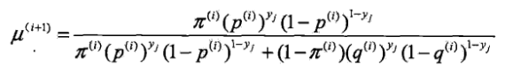
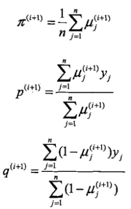
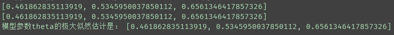

## EM(极大似然估计)
 
代码查看：[EM.py](EM.py)  
  

***

**三硬币模型举例：** 
三枚硬币A、B、C，这些硬币正面出现的概率分别为&pi;, p, q, 观测数据为：  
&emsp;&emsp;&emsp;&emsp;1,1,0,1,0,0,1,0,1,1  
试估计模型参数 &theta; = (&pi;,p,q)的极大似然估计。 （初值 &pi;=0.46，p=0.55，q=0.67）  
 
EM算法首先选取参数的初值，记作&theta;\_0 =(&pi;\_0,p\_0,q\_0)，然后不断通过迭代计算参数的估计值，直至参数收敛。  
 
E步：计算在模型参数&pi;\_(i), p\_(i), q\_(i) 下观测数据y\_i来自投掷硬币B的概率： 
&emsp;&emsp;  
M步：计算模型参数的新估计值：  
&emsp;&emsp;  
 
反复迭代E步和M步，直至参数的估计值收敛。 
 
运行结果： 

