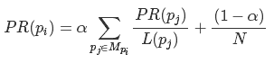
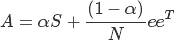
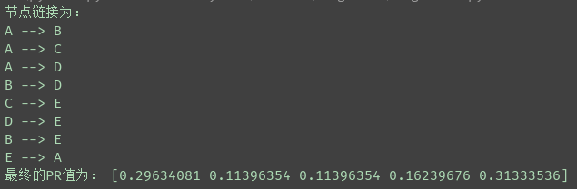

## PageRnk
源码查看：[PageRank.py](PageRank.py)  
 
数据集：[data.txt](data.txt)  

***
PageRank算法是由谷歌创始人Larry Page提出的，是一种网页排名算法，其核心内容是： 
1)如果多个网页都指向网页A，这网页A的排名较高； 
2)如果排名高的网页A指向了B，则网页B的排名也很高。 
 
一般网页的PR值的计算公式如下： 
&emsp;&emsp;  
&alpha;的取值一般为0.85，Mpi是指有出链到pi的所有网页，L(pj)是指网页pj的出链总数，N是网页总数。 
 

计算方法： 
1)首先构建矩阵S,S[i][j]表示网页j对网页i的出链，S[i]表示所有网页对网页i的出链值，S【:,j]表示j对所有网页的出链值。 
2)构建矩阵A： 
&emsp;&emsp; 
e是所有分量都为1的列向量 
3)进行迭代，P_n+1 = A \* P_n, 先对P_0赋初值，然后进行迭代，迭代停止条件有两种： 
&emsp;&emsp;a.当第n次迭代时的PR值与n-1次迭代时的PR值误差小于一个很小的阈值(比如0.0000001) 
&emsp;&emsp;b.迭代次数超过了自定义的迭代次数(如迭代10000次) 
 

***
运行结果： 
