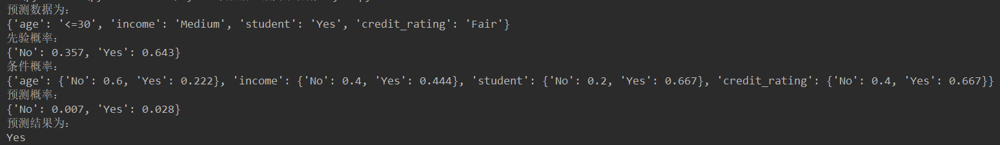
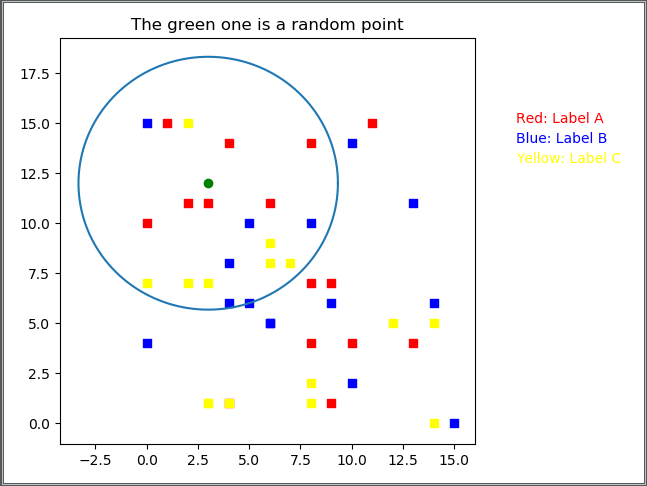
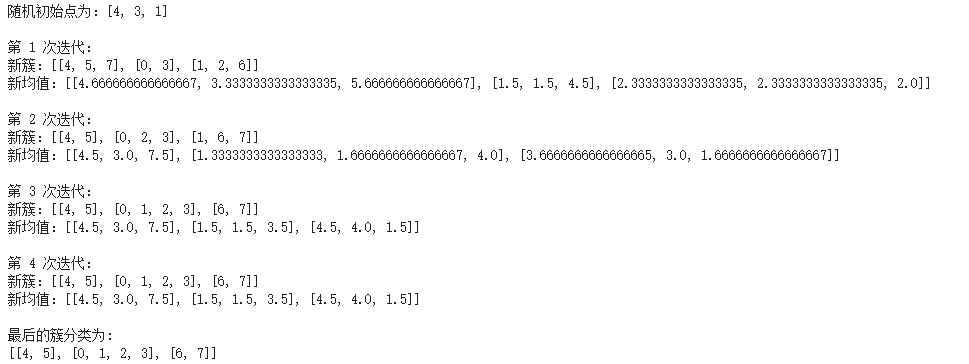

# DataMining 常用算法
用python实现数据挖掘常用算法  
 
参考资料：  
教材：《数据挖掘原理与算法(第三版)》 毛国君 段立娟 著  

***
## [决策树](https://github.com/MyBules/DataMining/tree/master/Decision_Tree) 
ID3决策树:  

 
C4.5决策树：  

  

## [Apriori 关联规则](https://github.com/MyBules/DataMining/tree/master/Apriori)

***

## [Bayes 分类](https://github.com/MyBules/DataMining/tree/master/Bayes)

***

## [KNN K-近邻](https://github.com/MyBules/DataMining/tree/master/KNN)

***

## [K-means K-均值](https://github.com/MyBules/DataMining/tree/master/K-means)

